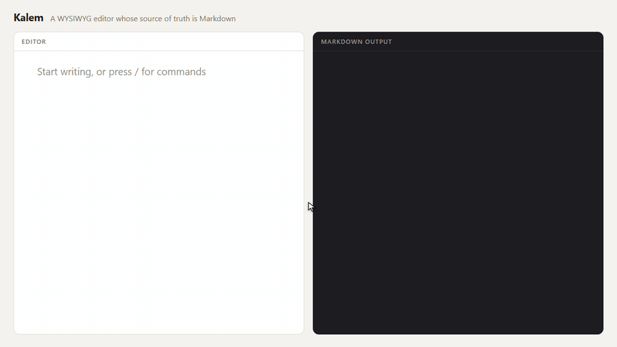

<!--
dev.to taslağı  (İş listesi: F6-11 → gönderim F6-14)

Gönderimden önce:
- `cover_image` dev.to'ya yüklenen görselin adresiyle değişmeli
  (`onizleme.png`, 1000×420'ye kırpılıyor — ortadaki metin güvende).
- `<PLAYGROUND_URL>` ve `<DOCS_URL>` doldurulacak.
- GIF dev.to'ya ayrıca yüklenecek; göreli yol orada çalışmıyor.
- Sayılar `pnpm guard:sizes` ile denetleniyor.
- "Where it falls short" bölümü gönderim günündeki duruma göre
  güncellenmeli: gidiş-dönüş boşlukları kapandıysa madde kalkar.
-->



Most of the text I deal with ends up as Markdown: documentation, a static
site, prompts and outputs of AI tools. Most of the people *writing* that text
have never heard of Markdown, and they shouldn't need to. They know Word.

So the job looks simple: give them a Word-like editor, save Markdown. I built
**Kalem** because every editor I tried did the second half badly.

## The problem: conversion is lossy

Most rich-text editors store the document as JSON or HTML and convert it to
Markdown on save. Markdown has many ways to write the same thing, and a
converter has to pick one:

```markdown
* a bullet          →  - a bullet
1) first            →  1. first
_emphasis_          →  *emphasis*
Heading             →  # Heading
=======
```

Each conversion is "correct". Together, they mean a user who fixes one typo
produces a diff that rewrites the whole file. In a repository reviewed by
humans, that's the end of the tool.

## The fix: remember how it was written

Kalem's source of truth is the Markdown text. Its parser builds a tree, but
every node also records its **syntax choices** — which bullet character,
which numbering delimiter, which emphasis marker, ATX or setext heading,
backtick or tilde fence. The serializer reads those choices back:

```ts
import { parse, serialize } from "@kalem-editor/core";

const md = "* a bullet\n\n1) first\n";
serialize(parse(md)) === md; // true
```

When the user edits a block, only that block's node changes. Every other
node — and its recorded syntax — is untouched, so its bytes come back the
same. Git shows the typo fix and nothing else.

This is also why Kalem has its own parser instead of wrapping an existing
one: general-purpose Markdown parsers are built to *render*, and they throw
exactly this information away.

## A block-based engine

The editor is a block engine: each paragraph, heading, list or code block is
its own `contenteditable` element, and the engine owns the model. The browser
never gets to decide what the document is.

That buys a few things:

- **Predictable editing.** One giant `contenteditable` lets the browser
  invent markup (`<div><br></div>`, nested `<span style>`) that then has to
  be cleaned up. Per-block editing keeps the browser's reach small.
- **Undo is the model's, not the browser's.** Edits are pure functions over
  an immutable tree, so undo is a stack of trees.
- **Drag handles are natural.** Moving a block is moving a node.

On top of the engine, `@kalem-editor/ui` adds what Word users expect: a bubble
toolbar on selection, a `/` slash menu, drag handles, a link popover, and
paste from Word that turns Word's `mso-list` pseudo-lists into real lists.

## Framework-agnostic, for real

The core is vanilla TypeScript with zero runtime dependencies. React and Vue
get thin wrappers that take the framework as a peer dependency — a Vue
project never downloads React. Everything else uses `<kalem-editor>`, a
form-associated custom element:

```html
<form method="post">
  <kalem-editor name="body" label="Post"># Hello</kalem-editor>
  <button>Save</button>
</form>
<script src="https://cdn.jsdelivr.net/npm/@kalem-editor/wc/dist/kalem-editor.iife.js"></script>
```

The form submits Markdown, like a `<textarea>` would. No build step.

## Small, and kept small

| Package | What it does | min+gzip |
|---|---|---|
| `@kalem-editor/core` | Parse and serialize, no DOM | 12.8 kB |
| `@kalem-editor/viewer` | Render to DOM or to a string (SSR) | 2.7 kB |
| `@kalem-editor/editor` | The block engine | 27.5 kB |
| `@kalem-editor/editor` + `@kalem-editor/ui` | The Word-like experience | 36.2 kB |

Every package has a size budget in CI, and a build over budget fails. The
numbers in the docs are checked against the measurement, so they can't
quietly go stale either.

## Tested in Turkish, on purpose

Kalem was built in Turkey, and its tests run under a Turkish locale. That
isn't patriotism. Turkish has a dotted and a dotless *i*:
`"i".toUpperCase()` is `"I"` in English but should be `"İ"` in Turkish, and
`"I".toLowerCase()` should be `"ı"`. Code that calls `toLowerCase()` without a
locale works in every English test and breaks for 80 million people.

Kalem's search, slash menu and find-and-replace all fold case using the
document's language, and a lint gate forbids locale-less case conversion in
the codebase.

## Where it falls short

I'd rather you read this here than find it on day one:

- **Round-trip gaps.** A few rare patterns are still normalized: indented
  continuation lines inside a paragraph, `#  Heading` with two spaces,
  whitespace-only blank lines. Each is tracked as a bug.
- **Tables are only partly editable.** Cell text, yes — only the edited
  row is rewritten. Adding rows and columns comes in v1.1.
- **Mobile works but isn't polished.** Drag-to-reorder has no touch
  equivalent yet.
- **No real-time collaboration.**
- **The API reference is in Turkish.** It's generated from the source
  comments, which are Turkish; the guides, recipes and everything else on
  the docs site are in English.

## Try it

- Playground: <PLAYGROUND_URL> — your document is compressed into the URL
  hash, so shared links never reach a server.
- GitHub: https://github.com/yusufkocak1/kalem
- Docs: <DOCS_URL>

```bash
npm i @kalem-editor/editor @kalem-editor/ui @kalem-editor/themes
```

If you have a Markdown document that doesn't survive the round trip, please
open an issue with it. That's the bug I care about most.
